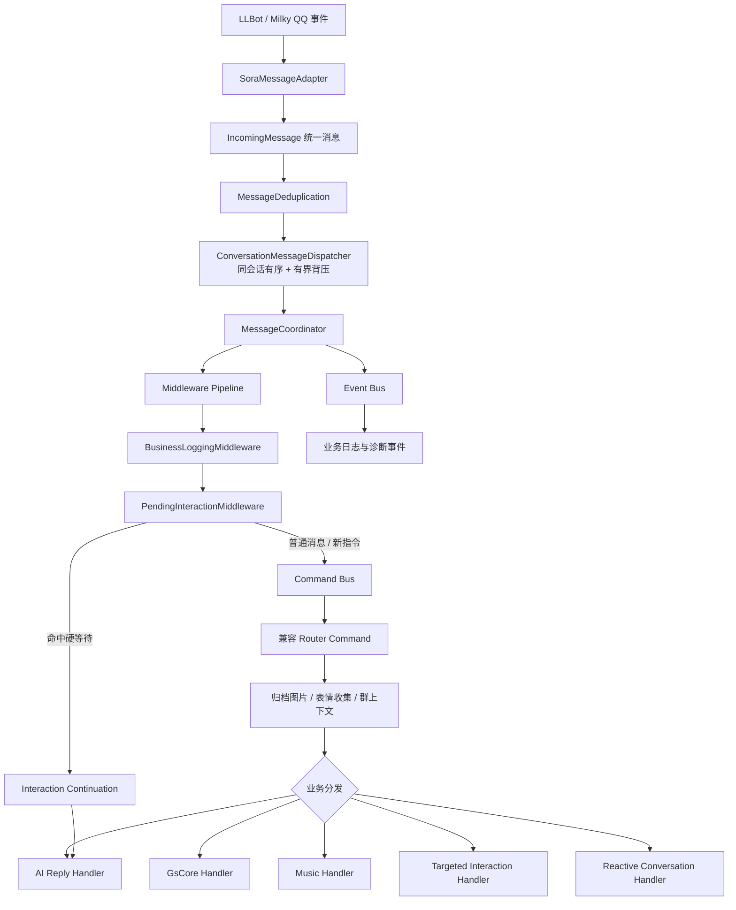

# Hime 方案 B：进程内事件驱动模块化单体

## 当前消息链路

适配器位于指令和业务逻辑之前。以后增加新平台时，新适配器只负责把原生事件转换为
`IncomingMessage`；Middleware、Interaction Manager、Command Handler 和 AI 服务无需理解平台原始消息。

## 等待输入

- `HardWait`：命令缺少参数时独占下一条非指令消息。例如私聊只发送 `~ai` 后，下一条文字或图片会续接本次 AI 请求。
- `SoftExpectation`：不消费下一条消息，只作为 AI/自然对话的候选语境。
- 等待状态存入 LiteDB 的 `pending_interactions` 集合，重启后未过期状态仍可恢复。
- 新的显式指令会替代旧硬等待；发送“取消”、`/取消`、`~取消` 或 `/cancel` 会清理当前会话等待。
- 一个会话同一时间只有一个硬等待，软期待可以并存。

## 性能边界

- Command Bus、Event Bus 和 Middleware 全部在进程内执行，不进行 HTTP 调用和 JSON 序列化。
- 原有 `ConversationMessageDispatcher` 继续提供分区并发、同会话顺序和有界队列。
- 慢操作仍在现有服务内部异步执行；架构层本身只有 DI 查找和少量委托调用。
- 不引入 RabbitMQ、Kafka、动态 DLL 热加载或多进程微服务。

## 渐进迁移状态

已经迁入独立 Command Handler：

- GsCore
- 自然语言点歌
- 定向成员互动
- 自然接话
- AI 回复与会话清理
- 私聊等待输入续接

Sora 的 `[Command]` 指令注册仍保留为兼容入口，确保现有鸣潮、表情、语音、管理等命令行为不回退。
后续逐个把这些命令的内部逻辑迁到 Command Handler；在最后一个命令迁移并完成回归后，再移除兼容 Router Command。

## 新功能接入规则

1. 平台差异只写在 Adapter 和平台发送器中。
2. 需要等待用户补充内容时，通过 `IInteractionManager` 注册状态，不在命令类内维护临时字典。
3. 有副作用的业务操作实现为 `ICommandHandler<TCommand>`。
4. 一对多通知、统计、审计使用 `IEventHandler<TEvent>`，不反向控制主流程。
5. 横切逻辑（权限、限流、等待、日志）使用 Middleware，不复制到每个命令。
6. 业务模块依赖服务接口，不直接依赖 Sora；迁移期允许在 Command DTO 中保留原生事件作为兼容桥。
